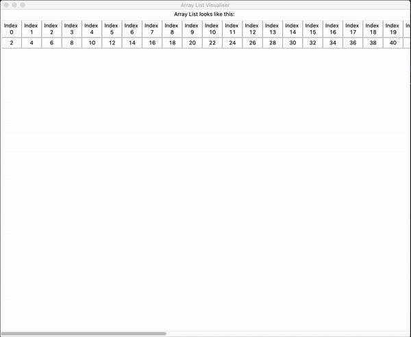
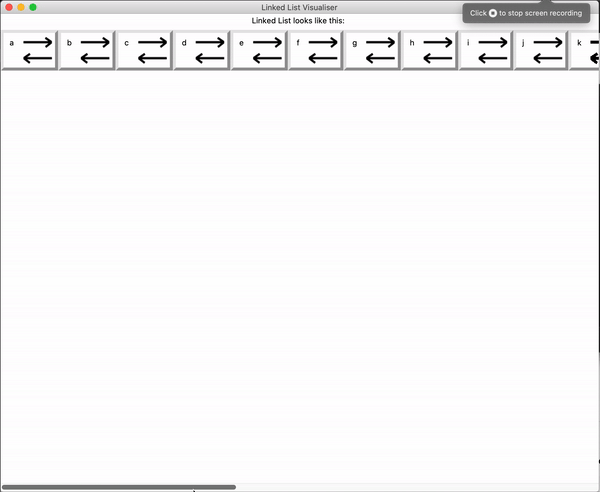
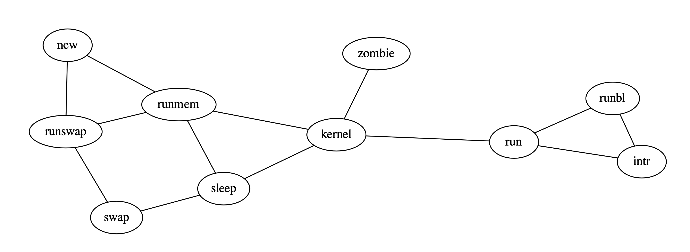

# Guide to Data Structure Visualiser

DSViz is a simple and intuitive Python interface to multiple packages in order to help visualise different data structres while codng them. This package is developed mainly for students or developers who are in the process of learning data structures. 

</br>  

How to use it ? Simple ! 

Step 1. Iterate over your Data Structure using the appropriate class

Step 2. Call the .add() method on each node

Step 3. Once you have added every node, use the .show property 

Step 4. Keep Coding ;)

Here are a few examples...

## Array List

Goal: Array List which stores even numbers from 2-100

```python
test =  ArrayListV()

for i in range(1,51):
    test.addNode(i * 2)

test.show
```


## Linked List

Goal: Circular Doubly Linked List which stores alphabets from a-z

> addNode(node) : adds nodes to the back of a linked list

We suggest you start at the head of the linked list and iterate to the end and call the add method on each node. The below example gives an idea on how the add method works and how the data structure is visualised.
> LinkedListV object upon creation has default CLL = False and DLL = False. These can be toggled upon object creation to change the how the pointers in the visualisation.

```python
test = LinkedListV(CLL=True, DLL=True)

for i in range(97, 123):
    test.addNode(chr(i))
    
test.show
```



## Graph

Goal: Visualise an undirected graph

>add(node1, node2) : creates an edge between two nodes, if the node exists, it creates an edge between the two, if node does not exist, it creates the node and the edge.

We suggest you to use the add method while iterating over your graph using BFS or DFS as per your choice. The below example is just a simple explanation of how the add method works.

```python
test = GraphV()

test.add('run', 'intr')
test.add('intr', 'runbl')
test.add('runbl', 'run')
test.add('run', 'kernel')
test.add('kernel', 'zombie')
test.add('kernel', 'sleep')
test.add('kernel', 'runmem')
test.add('sleep', 'swap')
test.add('swap', 'runswap')
test.add('runswap', 'new')
test.add('runswap', 'runmem')
test.add('new', 'runmem')
test.add('sleep', 'runmem')

test.show
```



A more detailed example is shown below. 

```python
class graph:

    def __init__(self, adjlist, directed = False):
        self.adjlist = adjlist
        self.directed = directed

    def visuliase(self, start):
        viz = GraphV(Directed=self.directed)
        edgeSet = set()
        VS = set()
        stack = []
        
        curr = start
        stack.append(curr)
        while len(stack) != 0:
            curr = stack.pop(-1)
            VS.add(curr)
            for adjacent in self.adjlist[curr]:
                found = False
                for element in edgeSet:
                    if curr in element and adjacent in element:
                        found = True
                if not found:
                    viz.add(curr, adjacent)
                if adjacent not in VS:
                    stack.append(adjacent)
                edgeSet.add((adjacent, curr))
                print(edgeSet)
            

        viz.show
```
One can then utilise this visualise method created.

```python
adjlist = {'0': ['1','4'],
           '1': ['0','4','3','2'],
           '2': ['1','3'],
           '3': ['1','2','4'],
           '4': ['0','1','3']}
test = graph(adjlist)
test.visuliase('4')
```


> Important Note: This package is a work in progress. These examples are a simple illustration of the simplicity of the package. Our aim is to make the package simple and intuitive.
